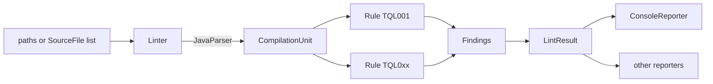

# Design

`tql` is a static linter: it parses Java test sources with
[JavaParser](https://javaparser.org/), runs a list of rules over each compilation unit, and
renders the findings. This document describes the pieces, what each one is responsible for,
where to plug in, and the trade-offs that were made on purpose.

## The pipeline

1. `Linter.lintPaths` walks directories for `*.java` files, drops the ones matching the exclude
   globs of the `RuleConfig`, and reads each into a `SourceFile` (path plus content).
2. Each `SourceFile` is parsed at Java 17 language level. A file that does not parse becomes a
   `ParseProblem` in the result instead of a silent gap.
3. Every enabled `Rule` gets the `CompilationUnit` and a `RuleContext` and returns its
   `Finding`s. Rules are stateless, run in id order, and never see each other's output.
4. The findings are collected into a `LintResult`, sorted by file, line, column and rule id, and
   handed to a `Reporter`.

## Modules and packages

| Module | Package | Responsibility |
|--------|---------|----------------|
| `tql-core` | `io.github.byreshb.tql.model` | Immutable value types: `Severity`, `Finding`, `SourceFile`, `ParseProblem`, `LintResult`. No logic beyond sorting and counting. |
| `tql-core` | `io.github.byreshb.tql.rule` | The rule API: `Rule`, `AbstractRule`, `RuleContext`, `RuleConfig`, `RuleRegistry`, plus the shared AST helpers `TestMethods` and `Assertions`. |
| `tql-core` | `io.github.byreshb.tql.engine` | `Linter`: parsing, exclusion, running rules, assembling the result. |
| `tql-core` | `io.github.byreshb.tql.rules` | One class per built-in rule, registered in `META-INF/services/io.github.byreshb.tql.rule.Rule`. |
| `tql-core` | `io.github.byreshb.tql.output` | `Reporter` and its implementations, starting with `ConsoleReporter`. |

Later increments add `tql-cli` (a picocli command over the core), `tql-maven-plugin` (a mojo
over the core) and `tql-benchmark` (a sample project used to validate the rules with mutation
testing). Neither the CLI nor the plugin contains logic of its own beyond argument handling.

## Class responsibilities

- **`Finding`** is a record with the rule id, severity, file, 1-based line and column, a
  one-sentence message, a one-sentence fix hint and the trimmed source line. Reporters render
  it; nothing else touches it.
- **`RuleContext`** is the only way a rule creates a `Finding`. It fills in the file, the
  position of the AST node, the snippet, and the severity after applying the configured
  override, so a rule cannot forget any of them or disagree with the configuration.
- **`RuleConfig`** is immutable and built with a builder. It answers four questions: is a rule
  enabled, what severity should its findings have, what are its options, and which files are
  excluded. Step 5 of the delivery plan adds loading it from `.tql.yaml`.
- **`RuleRegistry`** holds the rules sorted by id, refuses duplicate ids, and can discover rules
  through `ServiceLoader`, which is how the built-in rules and any third-party rule jar are found.
- **`TestMethods`** recognises `@Test`, `@ParameterizedTest`, `@RepeatedTest`, `@TestFactory` and
  `@TestTemplate` methods by annotation name, and JUnit 4 / TestNG expected-exception attributes.
- **`Assertions`** knows the method names of JUnit, TestNG, Hamcrest, AssertJ, Truth and
  Playwright assertions and can find the root of a fluent chain (`assertThat(x)` in
  `assertThat(x).as("...").isEqualTo(y)`).

## Symbol resolution

`Linter` parses syntax-only by default: fast, and correct on any checkout without needing the
project to compile first. Passing a classpath (`new Linter(registry, config, classpath)`, or
`Linter.withClasspath(classpath)`) turns on JavaParser's `JavaSymbolSolver`, combining a
`ReflectionTypeSolver` for the JDK with a `ClassLoaderTypeSolver` over the given jars and class
directories. An empty classpath list still enables resolution for JDK types; passing `null`
disables it. `RuleContext.symbolsResolved()` tells a rule which mode is in effect, so a rule that
needs a call's declared type (`UnusedTestResult` is the first: it needs to know whether a call
returns void) can report nothing rather than guess when no classpath was given.

## Reporters

`io.github.byreshb.tql.output` has one `Reporter` implementation per format: `ConsoleReporter`
(human-readable, coloured when writing to a terminal), `JsonReporter` and `SarifReporter` (both
built on a small hand-rolled `Json` string-escaping helper rather than a JSON library, since the
structure is simple and fixed), and `MarkdownReporter`. `SarifReporter` is constructed with the
rules the linter ran (for the SARIF `tool.driver.rules` array, which lets a viewer show a rule's
description even when it triggered nothing) and the linter's own version string; `tql-cli` passes
`Linter.enabledRules()` and `Cli.version()` (read from the jar manifest) into it.

## `tql-cli`

A second module, depending on `tql-core`, built around three picocli commands: `LintCommand`
(parses paths and options, builds a `Linter`, picks a `Reporter`, and exits non-zero when a
finding reaches `--fail-on` or a file failed to parse), `RulesCommand` and `ExplainCommand`
(both thin wrappers over `RuleRegistry`). `Main.main` is a two-line wrapper around `Cli.execute`,
which takes the `PrintWriter`s to write to as arguments; tests call `Cli.execute` directly with
`StringWriter`-backed writers, so the command logic is fully covered without spawning a process or
touching real standard output, and `Main` itself (the only place that calls `System.exit`) stays a
trivial, deliberately uncovered wrapper. `maven-shade-plugin` packages `tql-cli` into a single
executable jar, with a `ServicesResourceTransformer` so the `ServiceLoader`-based rule discovery
in the shaded jar still works.

## `action/` (TypeScript)

Node.js 22, TypeScript 5, ESM, strict mode, zero runtime dependencies. Each module does one
thing and is unit-tested on its own with Vitest: `severity.ts` (parsing and comparing
INFO/WARN/ERROR), `sarif.ts` (reading `tql lint --format sarif`'s output without a SARIF
library, since the shape is fixed and produced by `tql-core`'s own `SarifReporter`),
`summary.ts` (the job summary Markdown), `download.ts` (the release jar URL and fetching it),
`tql.ts` (the `java -jar ... lint` command line and running it), `upload.ts` (gzip + base64 the
SARIF and POST it to GitHub's `code-scanning/sarifs` endpoint directly, the same one
`github/codeql-action/upload-sarif` calls), and `actionsEnv.ts` (`INPUT_*`/`GITHUB_OUTPUT`/
`GITHUB_STEP_SUMMARY` handling, reimplemented over `node:process` and `node:fs` instead of
depending on `@actions/core`, small enough that the house rule preferring the standard library
applies cleanly). `main.ts` wires these together and is deliberately thin, excluded from the
coverage threshold the same way `tql-cli`'s `Main.main` is; `index.ts` is the two-line entry
point `action.yml` points at. `@vercel/ncc` bundles `src/index.ts` into a dependency-free
`dist/index.js`, committed because consumers run the action straight from a repository ref.

## `vscode-extension/` (TypeScript)

Structured as an LSP client and server so the linting logic is not VS Code-specific. The server
(`src/server/server.ts`) is the whole implementation: on `textDocument/didOpen` and
`textDocument/didSave`, for files `src/testFile.ts` recognises as tests, it spawns `java -jar
<jar> lint <file> --format json`, maps the JSON findings to LSP `Diagnostic`s
(`src/server/diagnostics.ts`), and answers `textDocument/codeAction` with a quick fix that
appends `// tql:ignore <id>` (`src/server/codeActions.ts`). `src/extension.ts` is a thin client:
it resolves `tql.jarPath` or downloads and caches the matching release jar
(`src/download.ts`, near-identical to the GitHub Action's, kept as a separate copy since the two
are independent npm packages), launches the server as a child process over IPC via
`vscode-languageclient`, and registers **TQL: Explain rule**. `@vercel/ncc` bundles the client and
the server into separate `dist/extension` and `dist/server` outputs (the server must stay
dependency-free of the `vscode` module so it can run outside VS Code); `@vscode/vsce` packages
`dist/`, `package.json`, `LICENSE` and the README into the `.vsix`, everything else excluded by
`.vscodeignore`.

Tested at two levels, per the house rule of testing the extension with the real thing: Vitest
over every module in `src/` except `extension.ts` and `server.ts` themselves (thin glue,
excluded from the coverage threshold, the same as `tql-cli`'s `Main.main`), and
`@vscode/test-electron` (`test/runTest.ts`, `test/suite/*.test.ts`) driving an actual downloaded
VS Code instance to confirm the extension activates, registers its command, and contributes its
settings.

## `tql-benchmark`

A fourth module, excluded from the coverage gate (`jacoco.skip=true`) since its own domain
classes exist to be mutated and half its tests are deliberately weak by design. Its test sources
under `src/test/java` ARE the fixture: 47 JUnit tests, the weak ones marked with a `@Weak`
annotation naming the rule id(s) they are planted to trigger, so the ground truth lives next to
the code it describes rather than in a separate label file. `BenchmarkRunner` (`mvn -pl
tql-benchmark exec:java@benchmark-report`, not bound to any lifecycle phase since it is meant to
be run on demand, after a `pitest-maven:mutationCoverage` run) does three things: reads that
ground truth by reflection, runs `Linter.withClasspath` over the planted sources and attributes
each finding back to its enclosing test method by re-parsing the file with JavaParser (a
`Finding` only carries a line and column), and parses PIT's `mutations.xml` for each mutant's
`killingTest` to count mutants killed per test method. `BenchmarkReport` turns the three into
`docs/benchmark.md`: precision and recall per rule against the planted labels, and the average
mutants killed by tests the linter flagged versus tests it left clean.

## `tql-maven-plugin`

A third module, depending on `tql-core` and the Maven plugin API/annotations. `LintMojo` is the
whole plugin: bound to the `verify` phase, it lints `${project.build.testSourceDirectory}`, logs
each finding through the Maven build log at a level matching its severity, always writes a SARIF
report (so CI can upload it whether the build passed or failed), and throws
`MojoFailureException` when a finding reaches `failOnSeverity` or a file failed to parse. Its
`@Parameter`-annotated fields are package-private rather than `private`, which lets
`LintMojoTest` set them directly and call `execute()` on a plain instance, skipping the weight of
`maven-plugin-testing-harness` for a Mojo with configuration this simple.

## Suppressions and configuration

`Linter.lint` runs each enabled rule over a file, then passes the file's raw findings through
`Suppressions.filter` (package-private, `io.github.byreshb.tql.engine`) before they reach the
result: a finding whose line carries a trailing `// tql:ignore` comment, or whose position falls
inside a declaration annotated `@SuppressWarnings("tql:...")`, is dropped there rather than
produced by the rule itself, so no rule needs to know about suppression.

`RuleConfigLoader` (`io.github.byreshb.tql.rule`) turns a `.tql.yaml` file into a `RuleConfig`
using snakeyaml's `Yaml.load`, which already turns YAML mappings, sequences, integers, booleans
and strings into the plain `Map`/`List`/`Object` values `RuleConfig.Builder.option` accepts, so no
YAML-specific type exists in the rule API itself. A structurally wrong file raises
`IllegalArgumentException` immediately rather than degrading to defaults, on the view that a
config file that fails to apply should be loud about it.

## Extension points

- **A new rule** is a class implementing `Rule` (or extending `AbstractRule`), registered in
  `META-INF/services/io.github.byreshb.tql.rule.Rule` of its jar. Put the jar on the linter's
  classpath and `RuleRegistry.discover()` picks it up. Ids outside `TQL0xx` are recommended for
  third-party rules so they never collide with a future built-in rule.
- **A new output format** is a `Reporter`. `render` is a default method over `write`.
- **Configuration** is programmatic through `RuleConfig.builder()`, which is what the file
  loader, the CLI options and the Maven plugin parameters all funnel into.

## Deliberate trade-offs

- **Syntax first, symbols optional.** Every rule works on names alone, without the project's
  classpath, because that is how a linter is usually run: on a checkout, before the build.
  Symbol resolution (step 4 of the delivery plan) is an upgrade that makes some rules more
  precise, not a requirement. `RuleContext.symbolsResolved()` tells a rule which mode it is in.
- **Name matching over type matching.** `assertEquals` is recognised whether it comes from
  JUnit 4, JUnit 5 or TestNG, and `assertThat` whether from AssertJ, Hamcrest, Truth or
  Playwright. This admits a false positive for a user-defined method with the same name, which
  is rare in test code and easy to suppress.
- **Structural equality for "the same expression".** TQL001 uses JavaParser's structural
  `equals` on expressions after stripping parentheses. `x` and `(x)` are the same; `x` and
  `this.x` are not. The rule prefers a miss over a wrong flag.
- **One parse per file, no caching across runs.** A run over a few thousand test files takes
  seconds; the simplicity is worth more than the saved time.
- **Findings are values, sorted once.** `LintResult` sorts at construction so every reporter,
  the CLI exit code and the Maven plugin agree on the order without repeating the work.
