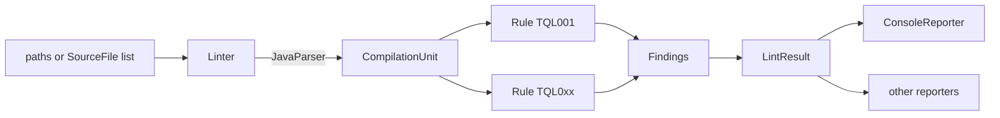

# Design

`tql` is a static linter: it parses Java test sources with
[JavaParser](https://javaparser.org/), runs a list of rules over each compilation unit, and
renders the findings. This document describes the pieces, what each one is responsible for,
where to plug in, and the trade-offs that were made on purpose.

## The pipeline

1. `Linter.lintPaths` walks directories for `*.java` files, drops the ones matching the exclude
   globs of the `RuleConfig`, and reads each into a `SourceFile` (path plus content).
2. Each `SourceFile` is parsed at Java 17 language level. A file that does not parse becomes a
   `ParseProblem` in the result instead of a silent gap.
3. Every enabled `Rule` gets the `CompilationUnit` and a `RuleContext` and returns its
   `Finding`s. Rules are stateless, run in id order, and never see each other's output.
4. The findings are collected into a `LintResult`, sorted by file, line, column and rule id, and
   handed to a `Reporter`.

## Modules and packages

| Module | Package | Responsibility |
|--------|---------|----------------|
| `tql-core` | `io.github.byreshb.tql.model` | Immutable value types: `Severity`, `Finding`, `SourceFile`, `ParseProblem`, `LintResult`. No logic beyond sorting and counting. |
| `tql-core` | `io.github.byreshb.tql.rule` | The rule API: `Rule`, `AbstractRule`, `RuleContext`, `RuleConfig`, `RuleRegistry`, plus the shared AST helpers `TestMethods` and `Assertions`. |
| `tql-core` | `io.github.byreshb.tql.engine` | `Linter`: parsing, exclusion, running rules, assembling the result. |
| `tql-core` | `io.github.byreshb.tql.rules` | One class per built-in rule, registered in `META-INF/services/io.github.byreshb.tql.rule.Rule`. |
| `tql-core` | `io.github.byreshb.tql.output` | `Reporter` and its implementations, starting with `ConsoleReporter`. |

Later increments add `tql-cli` (a picocli command over the core), `tql-maven-plugin` (a mojo
over the core) and `tql-benchmark` (a sample project used to validate the rules with mutation
testing). Neither the CLI nor the plugin contains logic of its own beyond argument handling.

## Class responsibilities

- **`Finding`** is a record with the rule id, severity, file, 1-based line and column, a
  one-sentence message, a one-sentence fix hint and the trimmed source line. Reporters render
  it; nothing else touches it.
- **`RuleContext`** is the only way a rule creates a `Finding`. It fills in the file, the
  position of the AST node, the snippet, and the severity after applying the configured
  override, so a rule cannot forget any of them or disagree with the configuration.
- **`RuleConfig`** is immutable and built with a builder. It answers four questions: is a rule
  enabled, what severity should its findings have, what are its options, and which files are
  excluded. Step 5 of the delivery plan adds loading it from `.tql.yaml`.
- **`RuleRegistry`** holds the rules sorted by id, refuses duplicate ids, and can discover rules
  through `ServiceLoader`, which is how the built-in rules and any third-party rule jar are found.
- **`TestMethods`** recognises `@Test`, `@ParameterizedTest`, `@RepeatedTest`, `@TestFactory` and
  `@TestTemplate` methods by annotation name, and JUnit 4 / TestNG expected-exception attributes.
- **`Assertions`** knows the method names of JUnit, TestNG, Hamcrest, AssertJ, Truth and
  Playwright assertions and can find the root of a fluent chain (`assertThat(x)` in
  `assertThat(x).as("...").isEqualTo(y)`).

## Symbol resolution

`Linter` parses syntax-only by default: fast, and correct on any checkout without needing the
project to compile first. Passing a classpath (`new Linter(registry, config, classpath)`, or
`Linter.withClasspath(classpath)`) turns on JavaParser's `JavaSymbolSolver`, combining a
`ReflectionTypeSolver` for the JDK with a `ClassLoaderTypeSolver` over the given jars and class
directories. An empty classpath list still enables resolution for JDK types; passing `null`
disables it. `RuleContext.symbolsResolved()` tells a rule which mode is in effect, so a rule that
needs a call's declared type (`UnusedTestResult` is the first: it needs to know whether a call
returns void) can report nothing rather than guess when no classpath was given.

## Extension points

- **A new rule** is a class implementing `Rule` (or extending `AbstractRule`), registered in
  `META-INF/services/io.github.byreshb.tql.rule.Rule` of its jar. Put the jar on the linter's
  classpath and `RuleRegistry.discover()` picks it up. Ids outside `TQL0xx` are recommended for
  third-party rules so they never collide with a future built-in rule.
- **A new output format** is a `Reporter`. `render` is a default method over `write`.
- **Configuration** is programmatic through `RuleConfig.builder()`, which is what the file
  loader, the CLI options and the Maven plugin parameters all funnel into.

## Deliberate trade-offs

- **Syntax first, symbols optional.** Every rule works on names alone, without the project's
  classpath, because that is how a linter is usually run: on a checkout, before the build.
  Symbol resolution (step 4 of the delivery plan) is an upgrade that makes some rules more
  precise, not a requirement. `RuleContext.symbolsResolved()` tells a rule which mode it is in.
- **Name matching over type matching.** `assertEquals` is recognised whether it comes from
  JUnit 4, JUnit 5 or TestNG, and `assertThat` whether from AssertJ, Hamcrest, Truth or
  Playwright. This admits a false positive for a user-defined method with the same name, which
  is rare in test code and easy to suppress.
- **Structural equality for "the same expression".** TQL001 uses JavaParser's structural
  `equals` on expressions after stripping parentheses. `x` and `(x)` are the same; `x` and
  `this.x` are not. The rule prefers a miss over a wrong flag.
- **One parse per file, no caching across runs.** A run over a few thousand test files takes
  seconds; the simplicity is worth more than the saved time.
- **Findings are values, sorted once.** `LintResult` sorts at construction so every reporter,
  the CLI exit code and the Maven plugin agree on the order without repeating the work.
